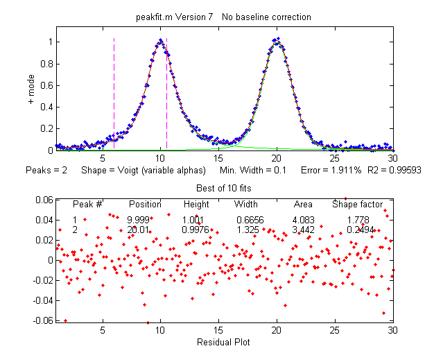
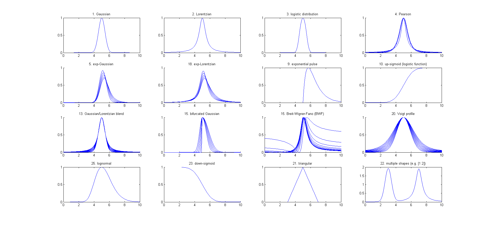

----
#### Peakfit Properties

```javascript
[FitResults, GOF, baseline, coeff, residuals, xi, yi, BootResults]=peakfit(signal, center, window, NumPeaks, peakshape, extra, NumTrials, start, AUTOZERO, fixedparameters, plots, bipolar, minwidth, DELTA, clipheight))
```

The screen display is shown on the right; the upper panel shows the data as blue dots, the combined model as a red line (ideally overlapping the blue dots), and the model components as green lines. The dotted magenta lines are the first-guess peak positions for the last fit. The lower panel shows the residuals (difference between the data and the model).



##### peakfit(signal)     
  Performs an iterative least-squares fit of a single unconstrained Gaussian peak to the entire data matrix "signal", which has x values in row 1 and Y values in row 2 (e.g. [x y]) or which may be a single signal vector (in which case the data points are plotted against their index numbers on the x axis).
  
  ##### peakfit(signal,center,window)      
  Fits a single unconstrained Gaussian peak to a portion of the matrix "signal". The portion is centered on the x-value "center" and has width "window" (in x units). 
  
  ##### peakfit(signal,center,window,NumPeaks,peakshape)
  
Shape 31 reports the peak height and position as that of the original Gaussian before broadening, whereas shape 39 reports the peak height of the broadened result
```
load DataMatrix3;
[FitResults,FitError] = peakfit(DataMatrix3, 1860.5, 364, 2, 31, 32.9731, 5,[1810 60 30 1910 60 30])
```

##### Used by me currently:  peakfit(signal,center,window,NumPeaks,peakshape, extra, NumTrials)
----
#### Anonymous function
an anonymous function is simply a function that exists only in memory - not in an \*.m file
